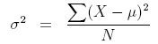

# Basic Statistical Concepts
This note outlines some of the basic statistical concepts, explained in simple terms without substantial mathematical equations and derivations (yay!), which I had to learn for my interests and career development.

#### Standard deviation
It quantifies how much the data is spread out. 

#### Standard Error
The standard deviation of all sample mean's mean: quantifies how far the sample mean is from the true population mean

#### Variance

#### Hypothesis Testing