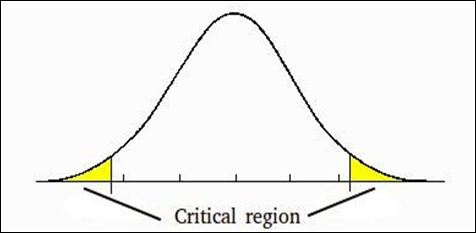

# Basic Statistical Concepts
This note outlines some of the basic statistical concepts, explained in simple terms without substantial mathematical equations and derivations (yay!).

## Standard deviation
It quantifies how much the data is spread out. 

## Standard Error
The standard deviation of all sample mean's mean: quantifies how far the sample mean is from the true population mean

## Variance

## Hypothesis Testing
Example  
* H0 (null hypothesis): Defendant is not guilty  
* Ha (alternative hypothesis): Defendant is guilty

Always assume that the null hypothesis is true, so null hypothesis can be thought as our initial assumption

Look at the following tables for possible scenarios:

| Decision/Actual            | Null Hypothesis (H0) | Alternative Hypothesis (Ha)  |
| ---------------------------|:-------------------------------:| :--------------------------------------:|
| Do not reject H0|                OK               |             Type II Error               |
| Reject Ha       |            Type I Error         |                  OK                     |

Type I Error: Reject null hypothesis when it's true 
Type II Error: Do not reject null hypothesis when it's false 

Three kinds of settings for hypothesis testing: 
* Right tailed, H0: μ=3, Ha: μ>3  
* Left tailed  , H0: μ=3, Ha: μ<3
* Two tailed, H0: μ=3, Ha: μ≠3

## Normal Distribution

  

-∞ < x < ∞, -∞ < μ < ∞

Example  
X is a random variable with normal distribution with mean μ and variance σ2 (σ is the standard deviation), then it's written as 
X ~ N(μ, σ2)

Standard normal distribution is Z ~ N(0, 1) where 0 is the mean and 1 is the variance.

## P-Value
Assume null hypothesis is true, the probability of observing a more extreme test statistics in the direction of alternative hypothesis

α is the significance level: The probability of making a type I error; When p-value < α we reject null hypothesis

Example  
Two tailed hypothesis testing: H0: μ=3, Ha: μ≠3  
  
If p-value = 0.0127, then we must double it for 2 tailed testing, which would be 0.0127*2 and then we compare it to α

## Z Table
The standard normal table shows the area under the curve. For a continuous variable, the probability they are equal to something is 0!

Example  
P<Z < 1.43)

## Power
The ability to reject false null hypothesis, also equals to 1 - Probability(Type II Error)  
In other words, it's the probability of rejecting null hypothesis when alternative hypothesis is true.

The larger the sample size, the higher the power!

## Sample size calculation

